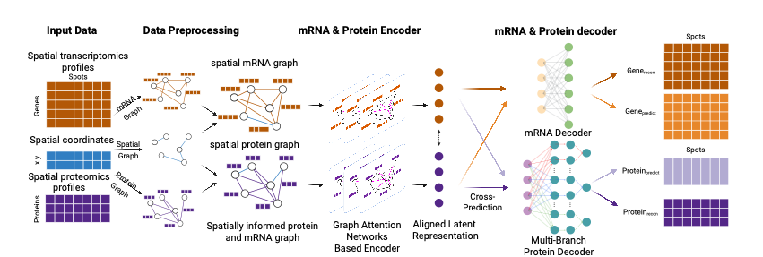

## Introduction
Spatial transcriptomics (ST) technologies provide genome-wide mRNA profiles in tissue context 
but lack direct protein-level measurements, which are critical for interpreting cellular function 
and microenvironmental organization. We present DGAT (Dual-Graph Attention Network), a 
deep learning framework that imputes spatial protein expression from transcriptomics-only ST 
data by learning RNA–protein relationships from spatial CITE-seq datasets. DGAT constructs 
heterogeneous graphs integrating transcriptomic, proteomic, and spatial information, encoded 
using graph attention networks. Task-specific decoders reconstruct mRNA and predict protein 
abundance from a shared latent representation. Benchmarking across public and in-house 
datasets—including tonsil, breast cancer, glioblastoma, and malignant mesothelioma—
demonstrates that DGAT outperforms existing methods in protein imputation accuracy. Applied 
to ST datasets lacking protein measurements, DGAT reveals spatially distinct cell states, 
immune phenotypes, and tissue architectures not evident from transcriptomics alone. DGAT 
enables proteome-level insights from transcriptomics-only data, bridging a critical gap in spatial 
omics and enhancing functional interpretation in cancer, immunology, and precision medicine.


## Data 
**The training datasets for DGAT model, pre-trained model and Spatial Transcriptomics for predictions can be downloaded [here](https://drive.google.com/drive/folders/1M9gIOFjK4wBk7DEj9MrwAlV8OHEgS2BA?usp=sharing).**

For prediction using pretrainde model, please download `DGAT_prediction_ST_data`, `DGAT_pretrained_models` to the same path as this Readme.

For training, please download `DGAT_training_datasets` to the same path as this Readme.

For reproduction, please download `DGAT_results_reproduction` to **./Reproduction/results/** before you run the scripts and notebooks.

## Installation
The code runs on Python 3.11.

You can install the required packages using pip:

  - For CUDA 
    ```
    pip install -r requirements_CUDA.txt
    ```
  - For CPU-only
    ```
    pip install -r requirements_CPU.txt
    ```
  - For already installed torch 
    ```
    pip install -r requirements_torch_ready.txt
    ```

    


## 10-minute Quick Start

### Train

[Demo1_Train](Demo1_Train.ipynb) notebook will lead you through the training process of DGAT model on one sample. Detailed instructions are provided in the notebook.

### Predict

To run the prediction demo after [Demo1_Train](Demo1_Train.ipynb) notebook, you can follow the [Demo2_Predict](Demo2_Predict.ipynb) notebook. This notebook will guide you through the process of using the pre-trained DGAT model from [Demo1_Train](Demo1_Train.ipynb) notebook to predict gene expression from Spatial Transcriptomics data and the downstream analysis.


## Further Explore

For further exploring, such as training on multiple samples from our datasets or yours, please follow the [Pretrain_DGAT](Pretrain_DGAT.ipynb) notebook.

[Demo3_Predict_ST](Demo3_Predict_ST.ipynb) notebook will guide you through the process of predicting protein expressions on ST datasets using the pre-trained DGAT model.

## Citation
```bibtex
@article{wang2025dgat,
title={{DGAT}: A Dual-Graph Attention Network for Inferring Spatial Protein Landscapes from Transcriptomics},
author={Wang, Haoyu and Cody, Brittany and Osmanbeyoglu, Hatice Ulku},
journal={bioRxiv},
year={2025},
doi={10.1101/2025.07.05.662121},
note = {preprint}
}
```